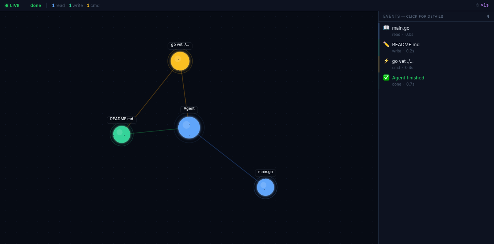

# Agent-live

**Watch your AI coding agent work — in real time, from a live dashboard.**

[](https://go.dev)
[](https://www.typescriptlang.org/)
[](LICENSE)

---

Agent-live wraps any AI coding agent (OpenCode, Claude Code, Codex) in a pseudo-terminal, parses its output into structured events, and opens a browser dashboard showing exactly what the agent is doing — **as it happens**.

```
agent-live run -- opencode "refactor the auth module"
```

→ Open http://localhost:8080 → **Live graph** of files read/written, **timeline** of every action, **status bar** with counters and elapsed time.



---

## Features

- **Live knowledge graph** — D3-force simulation visualises files, commands, and thoughts as connected nodes. Watch the graph grow as your agent works.
- **Event timeline** — Scrollable feed of every action with colour-coded icons and timestamps.
- **Status dashboard** — Connection status, live elapsed timer, file read/write counts, command counter.
- **Agent-agnostic** — Works with OpenCode, Claude Code, Codex, or any CLI agent. Just wrap it.
- **Single binary** — Frontend is embedded in the Go binary. No runtime dependencies.
- **Zero config** — Run `agent-live run -- <your-agent> "prompt"` and go.

---

## Quick Start

### Prerequisites

- Go 1.26+ (for building from source)
- Node.js 20+ (for building the dashboard)
- An AI coding agent (e.g., [OpenCode](https://github.com/anomalyco/opencode))

### Build

```bash
git clone https://github.com/yourusername/agent-live.git
cd agent-live
make build
```

This installs Node dependencies, builds the dashboard, and compiles the Go binary with the frontend embedded.

### Run

```bash
./agent-live run -- opencode "explain this codebase"
```

Or with any other agent:

```bash
./agent-live run -- claude "write unit tests for the parser"
./agent-live run -- codex "refactor the main function"
```

Open [http://localhost:8080](http://localhost:8080) in your browser to see the live dashboard.

### Options

```bash
agent-live -host 127.0.0.1 -port 9090 run -- opencode "prompt"     # Custom host & port (default: 127.0.0.1:8080)
agent-live -host 0.0.0.0                                            # Listen on all interfaces
agent-live -origin https://myapp.com run -- ...                     # Restrict WS origin
agent-live -help                                                    # Show usage
agent-live -version                                                 # Show version
```

---

## How It Works

```
agent-live run -- opencode "prompt"
         │
         ▼
    ┌─────────────────────────────────────┐
    │ PTY Wrapper (Go)                    │
    │  • Spawns agent in a pseudo-terminal│
    │  • Captures all output in real time │
    └────────────┬────────────────────────┘
                 │ raw output
                 ▼
    ┌─────────────────────────────────────┐
    │ Parser                              │
    │  • JSON mode: reads OpenCode's      │
    │    structured JSON event stream     │
    │  • Regex fallback: pattern-matches  │
    │    plain text agent output          │
    └────────────┬────────────────────────┘
                 │ structured events
                 ▼
    ┌─────────────────────────────────────┐
    │ WebSocket Hub (Go)                  │
    │  • Broadcasts events to all clients │
    │  • Runs alongside HTTP server :8080 │
    └────────────┬────────────────────────┘
                 │ ws://localhost:8080
                 ▼
    ┌─────────────────────────────────────┐
    │ Browser Dashboard (React + Vite)    │
    │  • D3-force knowledge graph         │
    │  • Timeline feed with icons         │
    │  • Status bar with live counters    │
    └─────────────────────────────────────┘
```

### Event Types

| Event | Icon | What it means | Graph colour |
|-------|------|---------------|--------------|
| `file_read` | 📖 | Agent read a file | Blue `#3b82f6` |
| `file_write` | ✏️ | Agent wrote/edited a file | Green `#22c55e` |
| `command` | ⚡ | Agent ran a shell command | Yellow `#eab308` |
| `thought` | 💭 | Agent reasoning or output | Purple `#a855f7` |
| `plan_step` | 🎯 | Agent declared a planning step | Cyan `#06b6d4` |

---

### Usage

Agent-live supports two event capture modes:

**Recommended — JSON mode (OpenCode only):**

```bash
# OpenCode with JSON event format produces rich, structured events
agent-live run -- opencode run --format json --model opencode/deepseek-v4-flash "your prompt"
```

**Generic — regex fallback (any agent):**

```bash
# Works with any CLI agent (Claude Code, Codex, etc.)
agent-live run -- claude "write a README"
```

Agent-live inspects each line of output and attempts to parse it as JSON first (for `opencode run --format json`), then falls back to regex pattern matching on plain text. This means all agents work out of the box, with richer events from OpenCode's JSON mode.

### Options

### OpenCode Server Mode

For the richest event experience, run OpenCode in server mode first:

```bash
# Terminal 1: Start the OpenCode server
opencode serve --port 4096

# Terminal 2: Run agent-live attached to the server
agent-live run -- opencode run --attach http://localhost:4096 \
  --format json --model opencode/deepseek-v4-flash "your prompt"
```

The JSON format gives agent-live structured file read/write events, command executions, and plan steps — making the graph much more detailed.

---

## Project Structure

```
agent-live/
├── main.go              # Entry point, PTY wrapper, HTTP server
├── parser.go            # JSON + regex agent output parser
├── events.go            # Event type definitions
├── hub.go               # WebSocket broadcast hub
├── dashboard/           # React frontend
│   └── src/
│       ├── App.tsx      # Main app, WebSocket (with reconnect), event→graph wiring
│       ├── Graph/       # D3-force knowledge graph
│       ├── Timeline/    # Event feed
│       └── StatusBar/   # Connection light, counters, timer
├── Makefile             # build/check/dev/clean targets
└── agent-live           # Compiled binary (after make build, gitignored)
```

---

## Development

```bash
# Full build (npm install → vite build → go build)
make build

# Run Go checks
make check

# TypeScript checks
make tscheck

# CI pipeline (lint + typecheck + build)
make ci

# Dev mode (separate terminals)
make deps
cd dashboard && npx vite        # Terminal 1: Vite dev server :5173
./agent-live run -- opencode ...  # Terminal 2: agent-live
```

---

## License

MIT
